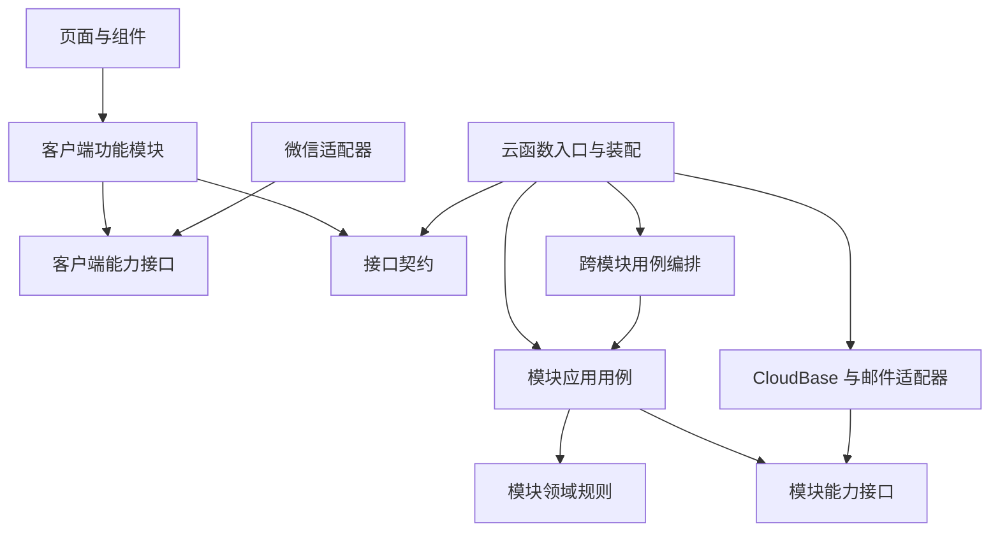

# 模块边界与数据所有权

状态：目标规范。所有权是代码与数据写入边界，不要求每个模块独立部署。

2026-09-21 上线保护扩展的具体接口与集合见 [治理技术设计](community-governance.md)，结构决定见 [ADR 003](decisions/003-community-safety.md)。新增规范待实现，不将目标当成当前运行状态。

## 业务模块

| 模块 | 拥有的规则/数据 | 对外能力 | 不得承担 |
|---|---|---|---|
| identity | 账户、认证记录、公开标识映射 | 读取可信 Principal、本人/公开资料、认证用例 | 直接修改帖子/评论/通知表 |
| content | 帖子、分类、草稿、帖子公开状态与计数 | 内容可见性、发布/编辑/删除、分类、草稿、内容快照 | 私信、邮件发送、客户端状态 |
| interaction | 评论、回复关系与可见性 | 创建/删除/分页评论、互动事件 | 直接操作 posts 记录或通知记录 |
| messaging | 会话、成员、消息、同步序列、读取位置 | 发送、历史、同步、会话目录、已读与未读 | 依赖公开帖子能否加载来授权已有会话 |
| notifications | 通知投影、接收者与已读状态 | 幂等消费互动事件、读取/已读/计数 | 读取时临时扫描修复全量历史 |
| governance | 举报、个案证据、决定、申诉、管理审计及结果事件 | 接案、处置决定、本人处理进度 | 直接修改他模块数据、人工预审发布队列、任意私信或匿名身份查询 |
| moderation | 平台无关的自动检查计划与结果判定 | 限时检查不可变提交，全文覆盖、结果摘要绑定 | 自行发布内容、外置审核平台、后台延时发送 |
| workflows | 跨模块应用流程编排，无独立业务实体 | 评论与帖子计数原子变更、资料投影更新等 | 通用万能服务、直接查询数据库 |

“content”内的帖子、分类和草稿先同一模块，下设用例即可。只有当真实依赖冲突或变化频率证明需要时才继续拆包；不是一个集合必须对应一个包。

### 服务端最小共享部分

`packages/server/src/shared/` 只容纳有清晰语义的 Principal、错误分类、Clock/IdGenerator 等能力接口以及 UnitOfWork/事件投递契约。不放含业务分支的通用 utils，不成为所有类型的集中仓库。

公开 API DTO 属于 contracts；领域类型属于拥有该业务的模块；SDK 文档类型属于 adapters；页面状态属于对应 feature。它们可映射，不相互冒充。

## 依赖图和强制规则

图示为源码依赖方向；运行时调用通过注入的实现完成。客户端应用装配层选择微信适配器，业务 feature 不自行创建 SDK 实例。

- domain 不导入 contracts、wx、Node 专用能力、环境变量或其他业务模块。
- application 可用同模块 domain/ports、最小 shared；需要其他业务能力时声明窄 port，由装配或 workflows 连接。禁止模块 A 与 B 相互导入应用服务。
- workflows 只导入各模块公开接口；不得通过深层文件路径取得内部实体或仓储实现。
- adapters 依赖其实现的 port 及 SDK；基础设施变化不要求领域层导入 SDK。
- 云函数入口验证协议、取得调用上下文、装配用例、映射错误及 DTO；不堆积查询与业务分支。
- 通用展示组件只接收显示值和发出事件。需要业务权限或读取状态的组件归属 feature，由上层传入能力。
- 主包不得导入聊天分包内部；分包只使用允许共享的公开入口。每个分包的产物依赖必须在设备上可解析。
- 包导出、路径别名、编译项目、架构检查使用同一份边界定义，不能靠命名规范代替检查。

## 身份和跨模块读取

每次私有请求在服务端构造可信 Principal，携带必要账户标识、认证与角色信息；客户端不能构造它。匿名公开读取使用权限缩减的 Viewer，不能与真实主体混用。入口 action policy 负责动作级登录、认证和角色判断；业务用例只保留资源级判断（例如作者身份、会话成员关系或被标记内容的管理员可见性），不得再次查询同一动作的账户状态。

可撤销许可是必要例外：发帖、评论、资料修改、私信、处置等最终提交，通过 identity 的窄写入屏障检查当前同意、限制和账号代际，并与禁言／注销竞争同一 lifecycle 文档。它解决入口检查后权限发生变化的竞态，不是重复构造 Principal；messaging 对发送与屏蔽／拒收另有同事务屏障。共享 SDK transaction 仍只在适配器内部。

identity 不把完整用户数据库记录交给其他模块。内容模块只获取 AuthorSnapshot 或能力判断；消息模块获取 PublicProfile 与会话目标解析结果。真正存储的身份字段留在服务端，响应映射显式筛选。

identity 更新资料后发出版本化事件，内容/通知模块更新自己拥有的公开快照。保留昵称头像更新能够最终反映到非匿名内容的行为，避免在身份用例里直接跨表扇出。匿名快照不被真实资料覆盖。

## 事务和副作用

应用层定义“哪些变化必须一起提交”，CloudBase 适配器负责实现事务。可以用 UnitOfWork 回调提供事务作用域内的业务能力，不能把 SDK transaction 或任意 collection 名称暴露给业务模块。

典型流程：

1. 创建评论：验证身份、帖子和父评论 → 在同一工作单元中重新校验可回复状态、写评论、通过 content 的计数能力更新帖子、持久化待发事件 → 提交。
2. 消费事件：notifications 幂等生成通知；失败保留可重试记录；用户读请求只读取结果。
3. 发布帖子：content 同时维护帖子、分类计数与幂等结果；外部网络调用在事务外完成。
4. 发送消息：messaging 原子处理请求去重、消息/同步记录、会话摘要及成员状态；重试不得重复增加未读。

工作单元可跨集合但不得跨无法共享事务的远程服务。若平台限制使某个设计无法原子执行，先记录决策，改为可补偿且可证明收敛的流程，不能依次写入后声称有事务保障。

## 持久化归属

| 集合族 | 写入所有者 | 权限目标 |
|---|---|---|
| users、email_verifications、公开标识映射 | identity | 服务端私有 |
| account_lifecycle、同意／协议记录、privacy_requests | identity | 服务端私有；仅本人必要权利及受限处理角色可经接口访问 |
| posts、categories、drafts | content | 客户端均经接口；categories 旧只读权限在兼容窗口内保留 |
| comments | interaction | 服务端私有 |
| messages、会话/成员/同步数据 | messaging | 服务端私有 |
| notifications | notifications | 服务端私有 |
| 案件、最小证据、决定／审计、治理结果 outbox | governance | 服务端私有；默认不提供匿名真实身份 |
| rate_limits、幂等记录、outbox、migration ledger、audit | 对应基础设施适配器，通过受限 port 使用 | 服务端私有、按用途限制读取 |

新集合名称、索引和存储布局由对应实施阶段确定并纳入版本化 manifest；本表是所有权而非可直接部署的建表脚本。

## 旧代码迁移映射

| 当前实现 | 目标落点 |
|---|---|
| common/utils 中权限查询 | identity 查询能力及入口 Principal 构造 |
| common/utils 中敏感词、计数状态规则 | content/interaction 所有的纯规则；真正共同语义才共享 |
| common/utils 中限流和 ID 工具 | 能力接口 + adapter，实现与业务策略分开 |
| messages/index.js 中通知动作 | notifications 用例，外部 messages 函数兼容路由继续转发 |
| posts/comments 中跨表操作 | 模块内用例 + 必要的 workflows 与事务 port |
| users 中跨表作者快照同步 | 版本化事件 + 各拥有模块消费 |
| editor 页面业务流程 | editor feature，页面保留 UI 与生命周期绑定 |
| services/session、badge、watch | 会话 feature、通知/消息状态与轮询调度能力，统一失效协议 |
| cloud.ts 和 cloudbase.d.ts | transport adapter、contracts、独立存储与视图模型 |

迁移结束每项只有一个权威实现。旧入口可保留薄兼容转换，不能保留两套独立业务逻辑。
