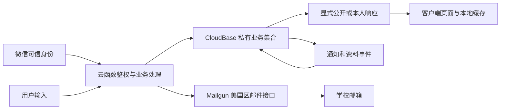

# LynkU 上线准备审查

状态：**2026-09-21 的内部审查快照，公开上线门槛未通过**。本文件记录发现与依据，不是平台批准、律师法律意见或第三方法定审计报告。后续整改状态只更新 [status.md](../plans/refactor/status.md)，实施顺序与办事材料见 [上线准备手册](../runbooks/launch-preparation.md)。

## 1. 审查结论与范围

用户目标是尽快上线面向 UNNC 的微信校园社区。保留微信基础身份、学校邮箱权限升级、既有账号和认证；不擅自删除匿名、私信或改成另一种产品。现有主体与功能准入、真实身份认证依据、内容治理、个人信息权利、外部邮件处理及真实发布验收存在缺口。**协议页面只能解决其中一部分，当前不能据此提交一个声称已合规的完整社区版本。**

最快的合理路径是并行处理平台/主管部门确认和确定需要的治理能力，复用已有代码；不能以“校园”“非营利”或“仅供交流”替代类目和管理义务，也不把所有架构升级都当成新的行政上线手续。原重构目标仍有效，纯维护项与安全发布门槛分别验收。用户后续明确要求按“没有非个人主体”分析，以校园论坛尽快让同学使用为优先，保留执行者判断，不因普通信息缺失反复提问；具体推进见手册的最小首发顺序。

### 已确认的产品事实

- 原生微信小程序和 CloudBase；公开配置以 [config/project.json](../../config/project.json) 为准，AppID 与用户提供信息一致。本次不重复存储管理员昵称、个人联系邮箱或主体完整证件信息。
- 公开浏览、学校邮箱认证、文本帖子/两级评论、前台匿名、普通/匿名私信、通知、资料及草稿。
- 未发现支付、交易撮合、广告投放、直播、推荐算法、生成式 AI 服务或真实的照片/视频上传入口。不得将这些未来能力的全部资质当成当前必办清单；增加相应业务时重新审查。
- 设置可改昵称；服务端资料接口还接受头像 URL。已有头像显示不等于有完整的图片上传功能。
- README 已有非官方与非营利描述；应用登录和关于页尚未同样明确运营主体与学校关系。

### 证据口径

| 标记 | 含义 | 限制 |
|---|---|---|
| 代码核查 | 查看当前 apps、packages、config、tooling 和现行文档 | 未发现不等于平台后台绝对不存在；函数有能力不等于有用户/管理员可用流程 |
| 本地执行 | 本轮真实运行的检查 | 证明对应模型/构建，不能证明云端或真机 |
| 既有证据 | 状态文件与此前生成的报告 | 本轮未重新登录后台或重跑云端；历史报告不等于最终发布版本 |
| 用户提供 | 个人主体、教育信息展示、已认证/已备案/隐私指引已更新、未发布；后续要求按没有非个人主体处理 | 未取得后台完整材料、备案号和运营主体所在地；暂缺信息留在材料表，不继续追问 |
| 规则核验 | 微信/政府/服务商官方资料 | 类目及后台流程提交时再核验；条文适用判断与官方书面答复分开 |

审查开始 HEAD 为 `04ad0d3eae734948b3f9a690487421b42f37fa4a`，分支 `main`，存在其他任务正在进行的评论、轮询、文档及依赖改动；本次保留这些改动。没有操作真实用户数据、发送邮件/工单、部署、提交审核或发布。

## 2. 准入与主体问题

| ID | 判定 | 发现和依据 | 关闭条件 |
|---|---|---|---|
| L01 | 准入阻塞 | 微信个人主体“教育信息展示”限定信息展示；UGC 社区/论坛在非个人主体目录。现有开放发帖交流与所报类目明显不匹配，这是功能匹配判断。[S01](https://developers.weixin.qq.com/miniprogram/product/material/) | 提交完整功能说明，取得具体主体/类目/材料路径；后台具备获准类目，备案与实际功能一致 |
| L02 | 准入阻塞 | 微信运营规范 5.23.3 限制主动隐藏真实身份的通讯/社交/信息交互服务；未写后台保留 OPENID 即可豁免。匿名机制不能仅凭法律“后台实名、前台自愿”认定平台允许。[S02](https://developers.weixin.qq.com/miniprogram/product/) | 平台针对实际匿名流程给出明确可行边界，并落实最终发布范围；若需改变产品范围，由用户决定并同步产品契约 |
| L03 | 发布阻塞 | OPENID 识别微信账号，邮件验证码证明邮箱控制权；目前没有足够证据把二者等同已履行发帖/评论/即时通讯的真实身份认证。[S03](https://www.cac.gov.cn/2022-06/14/c_1656821626455324.htm)、[S04](https://www.cac.gov.cn/2022-11/16/c_1670253725725039.htm) | 确认适用且平台支持的认证方案，保留验证结果和最小必要记录；认证门槛由服务端执行，不自行扩收身份证照片 |
| L04 | 安全评估为上线前门槛，其余按适用性办理 | 用户提供已备案，未取得备案号/详情；论坛/信息分享功能应依规定在上线前开展安全评估并报送；公安联网备案、等保定级的对象和办理口径另核实。[S05](https://www.miit.gov.cn/zwgk/zcwj/wjfb/tz/art/2023/art_920db564162e4312916a01bed6540ad8.html)、[S06](https://www.cac.gov.cn/2018-11/15/c_1123716072.htm) | 按主体所在地和实际业务形成适用清单，必要材料按要求提交；不把电信备案、公安备案、安全评估、等级保护混成一件事 |

说明：社区/论坛类目列出的非政府主体材料是《非经营性互联网信息服务备案核准》。陌生/熟人交友类目有不同的经营许可要求，**附属私信是否另属交友服务必须具体确认**。当前小程序“已备案”能否用作类目所需材料，也不能只凭名称直接判定。

官方已提供个人小程序变更为非个人主体的流程，目标类型含个体工商户，详见手册中的腾讯客服原始链接。本次不承诺本账号必然满足全部条件、一定保留 AppID/OPENID/云资源，或注册某种主体一定获准。账号迁移、新建 AppID、域名/备案变更及真实数据迁移均须核验影响；不为加快审核隐藏入口、设置审核员特殊版本或审核后恢复未获准功能。

## 3. 协议、内容治理与用户保护

| ID | 判定 | 当前实现证据 | 必须交付与验收 |
|---|---|---|---|
| L05 | 发布阻塞 | [app.json](../../apps/miniprogram/app.json) 无协议路由；[app.ts](../../apps/miniprogram/app.ts) 启动恢复/建立账号；[ensure-account.ts](../../packages/server/src/identity/ensure-account.ts) 无协议版本/接受时间 | 可随时查阅的服务协议、社区规则、隐私说明；明确接受与版本记录；启动时实际处理的告知时机和法律依据可解释；拒绝非必要处理仍能浏览 |
| L06 | 发布阻塞 | [common/index.js](../../apps/cloudfunctions/common/index.ts) 的 `filterContent` 主要使用固定敏感词；帖子/评论调用它，未发现微信内容安全接口或可靠人工复核流程 | 发布、修改、昵称等实际入口按范围审核；审核故障、超时、待复核不能直接公开；有负责人员、巡查与处置记录；图片能力开放前另验图片链路 |
| L07 | 发布阻塞 | 有管理员隐藏/恢复帖子接口，未发现完整用户举报、投诉联系方式、申诉、账号处罚及封禁态鉴权 | 帖子/评论/私信/账号均可举报；案件编号、证据最小化、处置、通知、申诉；普通用户不能查看举报人身份；禁言/封禁在服务端所有对应动作生效 |
| L08 | 发布阻塞 | 未发现特定用户屏蔽、拒收私信、关闭本人内容评论等完整防护机制 | 按实际服务落实防网暴选项、快捷取证与投诉；普通/匿名会话均生效且不泄露匿名映射；不能借拉黑提示推算真实身份 |
| L09 | 发布阻塞 | [settings.ts](../../apps/miniprogram/pages/settings/settings.ts) 的清理会话明确保留账号/认证；users 无注销/查阅复制申请闭环 | 便捷的注销、查阅复制、更正删除、撤回同意渠道；核实本人、防恶意注销、跨集合和本地缓存处理、法定留存例外；拒绝请求有理由与申诉途径 |
| L10 | 发布阻塞 | 删除评论更新 comments；通知及 notification_outbox 仍有 `comment_preview`，投递不重新核验来源；见下文 | 已删/屏蔽内容不能经通知/搜索/预览继续显示；删除与延迟投递竞争、历史通知、客户端缓存均有行为测试及云端证据 |
| L11 | 发布阻塞 | [update-profile.ts](../../packages/server/src/identity/update-profile.ts) 对 nickname/avatar_url 主要校验长度；游客可更新；未见该动作审核/限流 | 昵称审核、可信头像来源/协议校验、限制资料变更频率；不产生未受控外部图片请求或无限投影任务；禁用的能力服务端同样拒绝 |
| L12 | 适用事项待完成 | 无年龄/未成年人服务政策；学校邮箱不能证明用户已满18岁，公开浏览也不受邮箱限制 | 明确服务对象、防欺凌/未成年人模式及审计要求的适用方案；不满14岁另满足监护人同意与专门规则；不能仅写“限成人”就当措施已完成 |
| L19 | 账号信息保护与展示待落实 | 已有公开账号资料页；未发现IP属地展示；公开资料当前还使用OPENID。合理属地展示要求与底层身份标识最小化是两个事项 | 按可信来源实现合理粒度属地，不暴露原始IP/精确位置，不形成匿名关联旁路；评估使用独立公开用户ID替代OPENID |

L05 的依据包括个人信息保护法第13—17条和网络数据安全管理条例第21—24条。微信隐私授权机制针对平台隐私接口；自建邮件、云账号、内容和日志处理也须覆盖。保留自动微信身份这一产品规则，不恢复“微信登录/游客登录二选一”，但不能把隐私告知放到已经完成相关处理之后再补。

L06—L08 的依据为微信运营规范 5.18、10.2—10.5、跟帖评论管理规定第4/6/7/13条，以及网络暴力信息治理规定第7—9、23—27条。机审通过不能免除运营巡查；普通校园评论并非当然适用“所有内容法定先审后发”，本项目采用发布前检测、疑似内容人工复核是拟议实现方案。不得把任何对学校的批评一律定义为违法或以收费方式删帖。

### L10：删除后的内容残留

源码核查形成以下可执行复现路径，**本轮尚未在真实云端复现**：

1. A 对 B 的内容评论，生成带正文前100字的通知事件。[comments/index.js](../../apps/cloudfunctions/comments/index.ts) 中 `buildNotifications`、`notifyComment`。
2. 删除评论，评论本体正文被清空；该删除路径没有撤销已生成通知或待投递事件。
3. B 读取已有通知，或后台工作者在删除后投递旧事件，仍可能取得旧正文快照。[notifications.ts](../../packages/contracts/src/notifications.ts) 与 [CloudBase消息适配器](../../packages/adapters/src/cloudbase/messaging.ts)。
4. 修复必须覆盖已投递、未投递、投递中、离线缓存和后续重放，不能只改列表文案。匿名字段与收件人权限不能在修复中退化。

相关产品要求已在 [behavior-contract.md](../product/behavior-contract.md) 存在，属于修复缺陷，不需要改变产品范围。实施前根据当前源码补一个能失败的真实入口/副作用回归，再修复；关联 A03/A08/A09。并行完成的 [技术深查报告](../diagnosis/lynku-upgrade-review-2026-09-21.md) F04/F05等是技术缺陷的详细入口，复用其证据与修复顺序，不再维护第二套技术路线。

## 4. 个人信息与第三方数据流

当前未发现完整的收集清单、第三方清单、公开保留政策和跨集合销毁流程。下表是代码盘点，不是已经公示的隐私政策；“建议处理”尚未实施。

| 环节 | 当前数据及用途 | 存储/接收边界 | 应明确的处理规则 |
|---|---|---|---|
| 微信基础身份 | OPENID、内部账号ID、建立时间、角色、认证状态；云初始化启用traceUser | CloudBase users；客户端本人资料缓存；云平台统计能力 | 自动识别和平台统计的用途、必要性、告知/法律依据；本人DTO与公开DTO分开；注销后不得悄悄恢复原个人数据 |
| 学校邮箱认证 | 邮箱/待绑定邮箱、验证码哈希、有效期、尝试/发送次数、绑定记录 | users、email_verifications、email_send_limits、email_claims | 验证资格与恢复安全；验证码10分钟逻辑有效并不代表记录10分钟物理删除；绑定记录随账号生命周期处理 |
| 邮件发送 | 收件邮箱、验证码邮件正文、发送域名 | `api.mailgun.net` 接收；官方标为美国区 | 接收方法定主体/合同/地区/保存期限、影响评估与适用出境安排；不写“全部数据境内” |
| 公开内容与资料 | 帖子/评论正文、时间、分类、昵称、头像URL | 内容集合、公开DTO、作者快照 | 哪些主动公开；审核和删除传播；昵称不等于已核实姓名；不得未经必要性评估公开邮箱/OPENID |
| 前台匿名 | 作者/参与者真实映射、来源内容、匿名通道标识 | 私有内容/消息/会话目录；普通用户只得脱敏DTO | 前台隐藏而非不可复原匿名化；仅受控管理/依法协助处理；不得承诺“任何人都查不到” |
| 私信/通知 | 消息正文、双方标识、时间、已读、未读、摘要 | messages、conversation_entries、notifications/outbox | 会话成员授权、拒收、举报取证、保存期限、双方权益与注销后处理；禁止管理员常规任意浏览私信 |
| 草稿与本地恢复 | 未发布正文、版本、保存/删除任务、已读队列、搜索历史 | drafts及计数；按账号的本地恢复键；searchHistory | 未发布内容仍需保护；清理/注销覆盖设备缓存；搜索历史目前并非账号分区，不宣称全部本地数据已清除 |
| 运行/安全记录 | 限流、投影任务、错误、管理操作、备份 | rate_limits、两类outbox、云日志/仓库外备份 | 区分安全日志、业务内容、审核证据、备份；明确权限、最短必要保存及依法留存；到期处理和恢复后重删 |

数据流概况：

### L13：邮件与个人信息处理安排 — 发布阻塞

代码 [users/index.js](../../apps/cloudfunctions/users/index.ts) 的 `sendMailgunCode/requestMailgun` 明确发送上述信息；[Mailgun 官方](https://documentation.mailgun.com/docs/mailgun/api-reference/api-overview) 将该端点指定为 US。学校邮箱使用境外服务和是否有境外接收方均需按实际链路核实，不能凭学校在境内或发件域名自有直接认定。

继续现有已获授权的邮件方案时，补接收方及联系方式、合同/受托处理安排、实际留存与删除能力、出境必要性与个人信息保护影响评估、适用告知及单独同意。适用《促进和规范数据跨境流动规定》第5条的非关基运营者少量非敏感个人信息豁免，须核对全年累计人数、敏感信息和重要数据范围；不能据“小项目”直接判定，也不能把豁免三项出境手续说成豁免个人信息义务。换为境内邮件服务是待评估备选，不擅自切换已授权供应商、停用认证或作“必须换”的结论。

### L14：留存、审计与事件响应 — 发布阻塞

[cloudbase-schema.json](../../config/cloudbase-schema.json) 记录18个集合的权限/索引，没有表达 TTL 或完整留存/清理策略。帖子删除主要改状态，正文仍可在数据库中存在；评论正文虽清空，衍生副本仍须覆盖。匿名来源删除后既有会话仍可继续是既定产品规则，不能默默改成删源即销毁全部会话。

发布前交付可运行的数据分类留存表、定期删除任务、法律保全例外、备份生命周期、访问审计和事件处置流程。不能统一宣称“所有数据永久保存”，也不能为满足注销立即删除依法必须保存的证据。网络安全日志的法定留存与个人信息处理影响评估/第三方处理记录的留存是不同要求，不能套到全部私信正文。具体期限和法规依据由手册记录，实施前由运营责任人确认并落实。

小规模不等于不需要定期个人信息合规审查。2025年生效的合规审计办法及2026年官方问答允许按自身情况合理确定频度；超过1000万人每两年至少一次的规定不能反向解释为小平台免审计。此报告仅是本次内部证据，未覆盖后台全量配置、全部数据处理合同或现场访谈。

## 5. 技术发布与运行保障

| ID | 判定 | 本次证据 | 关闭条件 |
|---|---|---|---|
| L15 | 发布阻塞 | [cloudbaserc.json](../../cloudbaserc.json) 六函数仍为 Nodejs16.13；生产锁在线审计有4 high/1 moderate，0 critical；未证实具体可利用路径 | 选择该微信环境实际可用且有维护保障的运行时，真实SDK/OPENID/事务/timer/邮件兼容验证；分析受影响依赖可达性并有修复/有效缓解证据，不能仅按数量签风险接受 |
| L16 | 发布阻塞 | 完整本地检查通过，但双真实认证账号发帖/评论/草稿/普通及匿名私信、设备生命周期与 timer 故障恢复仍缺发布版本证据 | 对最终获准功能执行 A01—A15 的适用 G3/G4 场景，记录环境、账号类型、版本、结果，覆盖失败/重试/权限和并发 |
| L17 | 发布阻塞 | 有历史备份和迁移说明，无完整隔离恢复、部分函数部署失败及破坏性数据迁移后恢复演练证据 | 验证备份可读可恢复、指定账号保留、数据版本与函数矩阵、恢复后重删和前向修复；真实停写/恢复路径及负责人可执行 |
| L18 | 发布准备项 | README 已有非官方说明、WTFPL许可；应用关于页无运营信息/投诉/备案展示，未核验学校品牌资产授权 | 真实运营信息与学校关系、有效联系、备案入口、资源与依赖许可清单；明确源码开放策略与用户内容授权，避免把用户投稿版权全部转给平台 |

L15 的依赖审计来源是 `config/cloud-runtime` 内真实执行的 `npm audit --omit=dev --package-lock-only --json`，问题链包括 lodash.set / lodash.unset → @cloudbase/database → @cloudbase/node-sdk → wx-server-sdk。审计退出码非零反映发现漏洞；工具建议的 SDK 大幅降级不能机械执行。软件版本与支持信息参考 [Node 发布表](https://nodejs.org/en/about/previous-releases) / [EOL 表](https://nodejs.org/en/about/eol)，平台是否维护旧运行时须有直接证据。

截至本次核验，Node 20 上游也已 EOL。并行技术审查已把当前计划/状态的升级候选更新为Node24；历史“下一步Node20”不作为长期安全终态。按现行重构计划和其CloudBase官方来源核实受维护候选版本，仍须在此AppID对应环境中实测；不能仅凭普通腾讯云SCF版本表或本地配置宣布升级完成。

L18 中，软件著作权登记、商标布局可用于权利证明/品牌保护，不能代替平台准入。仓库现有 WTFPL 是需要尊重的既有许可事实；若改变未来开源策略，先核清贡献者和已分发版本，不能声称通过新增用户协议追溯撤销已授许可。学校品牌的使用范围可通过 [UNNC 品牌中心](https://www.nottingham.edu.cn/en/brand/our-brand.aspx) 核实，不推断目前已经侵权或学校已授权。

## 6. 本轮验证记录

| 检查 | 结果 | 实际能证明的范围 |
|---|---|---|
| `npm run check` | 本轮通过，221项测试，0失败/跳过；含类型、架构、文档、配置、schema、授权策略、错误码与独立云函数产物检查 | 当前共享工作区 G1/G2；日志在忽略目录 `dist/launch-audit/local-check.log`；包含并行任务当时已落地的回归，不归为本次修复 |
| 生产锁依赖审计 | 0 critical / 4 high / 1 moderate | 已知依赖公告，不是实际可利用性结论，也不是“安全通过” |
| 既有平台报告 | 找到 `dist/demo/smoke.json`、`mail-validation.json`、`acl-management.json` 与此前 release-check 日志 | 文件存在与既有状态可追踪；本轮未重新执行云端/真机验证 |
| 微信后台/主管部门/服务商合同 | 未访问后台、未提交询问、未取得合同 | 主体详情、类目、隐私指引正文、迁移能力和法律适用仍待闭环 |
| 新文档及链接 | 在交付前单独执行文档检查并核验新增文档本地链接；结果写入状态文件 | 文档可访问，不能证明所列功能已实现 |

现有测试覆盖不包含全部 L01—L19，221项通过不能关闭上述缺口。关于评论删除残留、头像外链等发现，本轮是源码路径审查，不能冒称真实攻击、渗透测试或云端漏洞复现。

## 7. 官方依据与适用边界

本次优先使用正式生效文本；没有使用征求意见稿作为现行义务。微信页面通过直接 HTTPS 读取核验，服务器文件修改时间不当成条款生效时间；政府页面发表/抓取时间也不替代法定生效日。

| 来源 | 本次使用范围 |
|---|---|
| [S01 微信服务类目](https://developers.weixin.qq.com/miniprogram/product/material/) | 个人教育信息展示；非个人社区/论坛；交友类目和材料区分，提交时再核验 |
| [S02 微信平台运营规范](https://developers.weixin.qq.com/miniprogram/product/) | 5.7类目匹配、5.18内容安全、5.19审核一致性、5.23.3匿名相关限制、10.2—10.5运营责任 |
| [S03 移动互联网应用程序信息服务管理规定](https://www.cac.gov.cn/2022-06/14/c_1656821626455324.htm) | 2022-08-01施行；真实身份、服务协议、内容治理、未成年人及安全评估。分发平台的备案义务不能直接套给本项目 |
| [S04 互联网跟帖评论服务管理规定](https://www.cac.gov.cn/2022-11/16/c_1670253725725039.htm) | 2022-12-15施行，替代2017版；实名、协议、审核、投诉申诉 |
| [S05 工信部APP备案通知](https://www.miit.gov.cn/zwgk/zcwj/wjfb/tz/art/2023/art_920db564162e4312916a01bed6540ad8.html) | 工信部信管〔2023〕105号；含小程序，备案真实准确、展示和变更；教育前置材料按实际业务咨询 |
| [S06 舆论属性/社会动员能力服务安全评估规定](https://www.cac.gov.cn/2018-11/15/c_1123716072.htm) | 2018-11-30施行；论坛/信息分享等，上线前评估与报送，可自行或委托实施，不是独立行政许可证 |
| [S07 个人信息保护法](https://www.samr.gov.cn/wljys/gzzd/art/2023/art_3ef1e889c1e644d4b65b5f5c7f432386.html) | 2021-11-01施行；必要性、告知、同意、公开/受托/出境、权利、影响评估和安全责任 |
| [S08 网络数据安全管理条例](https://www.cac.gov.cn/2024-09/30/c_1729384452307680.htm) | 2025-01-01施行；第9—12、20—27条，数据防护、第三方记录、集中清单、注销及合规审计 |
| [S09 网络暴力信息治理规定](https://www.cac.gov.cn/2024-06/14/c_1720043894161555.htm) | 2024-08-01施行；防骚扰、私信选项、取证、快捷举报、未成年人优先保护 |
| [S10 促进和规范数据跨境流动规定](https://www.cac.gov.cn/2024-03/22/c_1712776611775634.htm) | 2024-03-22施行；豁免条件与继续承担告知/单独同意/影响评估的边界 |
| [S11 Mailgun区域说明](https://documentation.mailgun.com/docs/mailgun/api-reference/api-overview) | `api.mailgun.net` 对应US，不代表已核完其合同及留存细节 |
| [S12 微信隐私授权开发指南](https://developers.weixin.qq.com/miniprogram/dev/framework/user-privacy/PrivacyAuthorize.html) | 平台指引配置、声明接口和授权同步；该机制不能覆盖全部自建服务端处理 |
| [S13 个人信息保护合规审计管理办法](https://www.cac.gov.cn/2025-02/14/c_1741233507681519.htm) / [2026年4月官方问答](https://www.cac.gov.cn/2026-04/29/c_1779200509387274.htm) | 2025-05-01施行；定期审查频度、内部/专业机构方式及未成年人特殊要求 |
| [S14 民法典侵权责任编](https://www.cac.gov.cn/2020-06/01/c_15925617772683196.htm) | 第1195—1197条；通知、必要措施、反通知和知道/应知责任，概括免责不能代替实际治理 |
| [S15 必要个人信息范围规定](https://www.cac.gov.cn/2021-03/22/c_1617990997054277.htm) | 含小程序；网络社区必要信息列移动电话号码，不据此扩大收集到完整身份证/通讯录 |
| [S16 Node维护状态](https://nodejs.org/en/about/previous-releases) / [EOL](https://nodejs.org/en/about/eol) | 上游生命周期；微信托管运行时支持须另取得平台证据 |
| [S17 UNNC品牌中心](https://www.nottingham.edu.cn/en/brand/our-brand.aspx) / [计算机软件保护条例](https://xzfg.moj.gov.cn/front/law/detail?LawID=914) | 品牌核验渠道与软件权利；不以登记替代准入，不替用户选择新开源许可 |
| [S18 现行网络安全法](https://www.cac.gov.cn/2025-12/29/c_1768735112911946.htm) | 2026-01-01施行修订；第23条相关网络日志不少于6个月，第26条发布/即时通讯实名；不误引旧条号 |
| [S19 未成年人网络保护条例](https://www.samr.gov.cn/wljys/gzzd/art/2024/art_43b2ac59aefd427aabe333df54d68f0a.html) | 2024-01-01施行；防欺凌、未成年人模式、处理未成年人信息的年度审计等，不能全部套大型平台门槛 |
| [S20 互联网用户账号信息管理规定](https://www.cac.gov.cn/2022-06/26/c_1657868775042841.htm) | 2022-08-01施行；第12条合理范围IP属地展示，未把征求意见稿中的具体粒度当现行原文 |
| [S21 国际联网安全保护管理办法](https://xzfg.moj.gov.cn/mobile/law/detail?LawID=498) / [等级保护管理办法](https://www.miit.gov.cn/jgsj/xxjsfzs/xxgk/art/2020/art_a981907528694176a61b5b52c2d19895.html) | 联网备案对象与时点、系统定级/二级以上备案；不一概认定所有个人小程序另办网站备案或必须等保三级 |

下一步从手册的工作包开始，关闭每一项时记录具体代码/测试、平台回执或运营材料的路径与版本。**本审查完成不等于L01—L19已整改，更不等于R8验收通过。**
