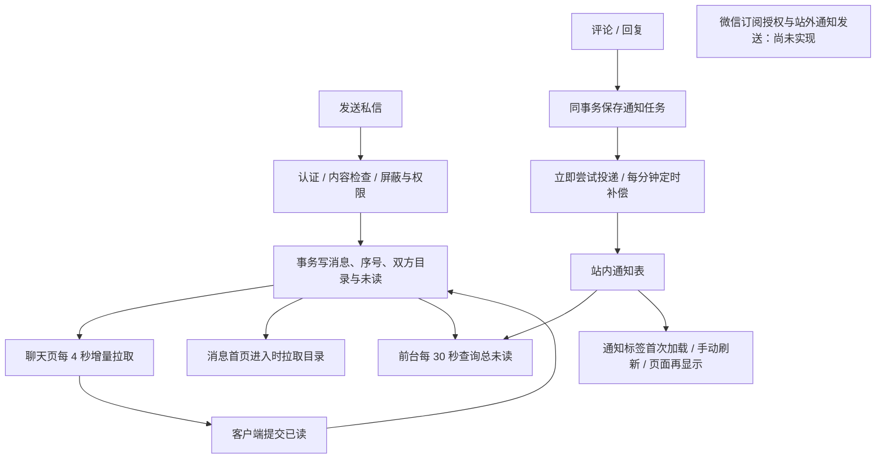

# 聊天界面与消息提醒诊断

日期：2026-09-23。状态：**修复前的历史诊断**。下文保留当时源码及复现证据，不作为当前缺陷仍存在的断言；后续本地实现见[唯一状态表](../plans/refactor/status.md)及[审核与迁移说明](../runbooks/anonymous-messaging-refinement.md)。诊断阶段未读取真实私信，未修改云端数据，未部署，没有双账号真机截图或设备验收；视觉判断来自 WXML/WXSS 和交互实现。

## 结论

用户感到聊天原始、提醒不可靠，有明确实现依据。当前消息事务、会话隔离、序号同步和服务端鉴权已有可复用基础；主要缺口集中在客户端消息状态协调、聊天连续性和失败恢复。此外，发现两项应优先处理的匿名隐私问题：界面错误承诺“双方身份隐藏”，以及匿名互动通知的公开编号可用于候选身份比对。

“推送”需要区分三件事：聊天内获取新消息、站内消息列表与角标、退出小程序后的微信提醒。目前前两者是分散的拉取流程，第三者尚未接入。

## 当前链路

依据：[轮询服务](../../apps/miniprogram/services/watch.ts)第 16、90–149 行、[App 生命周期](../../apps/miniprogram/app.ts)第 20–35、95–108 行、[消息首页](../../apps/miniprogram/pages/messages/messages.ts)第 51–127 行、[评论消费者](../../apps/cloudfunctions/comments/index.ts)第 145–195 行及 [定时配置](../../cloudbaserc.json)。一分钟是补偿调度间隔，并非每条评论固定等待一分钟；退避、请求和平台调度还会影响实际延迟。本次未重新读回线上定时器状态。

当前源码没有订阅授权、模板配置和微信订阅消息发送链路。站外提醒需要单独接入平台能力：用户授权、适用模板、服务端下发及失败处理。腾讯官方文档明确说明模板配置和用户点击触发授权的要求；具体可用模板与权限需以本 AppID 后台为准，不能直接承诺持续收到所有私信。[腾讯云：实现小程序订阅消息推送](https://cloud.tencent.com/document/product/1301/103770)

## 需要优先处理的问题

### 1. 匿名身份提示错误，可能影响用户是否愿意发言的决定（P1，A03/A04）

[聊天模板](../../apps/miniprogram/subpkg-chat/pages/chat/chat.wxml)第 3 行对所有匿名通道显示“独立匿名会话 · 双方身份隐藏”。现行规则是对端可见性：实名用户联系匿名作者时，作者仍可看到该实名用户；匿名用户联系实名对象时，发起者仍可看到对方实名资料。

[聊天页面](../../apps/miniprogram/subpkg-chat/pages/chat/chat.ts)第 49–50 行还会把所有匿名通道的名字覆盖为“匿名用户／匿名聊天”。合成验证中，匿名发起者联系实名 Bob，页面也显示为匿名聊天。这是客户端展示错位，不能据此推断服务端把双向身份都隐去了。

当前历史返回契约只含消息、游标和 chat_target，没有完整的本人／对端身份展示字段，见 [历史契约](../../packages/contracts/src/message-history.ts)第 16–22 行。应由服务端提供最小会话展示信息，界面分别说明“你以什么身份参与”和“对方显示什么身份”；不能用是否有 anonymousTarget 或当前全局匿名开关推断已建立会话的双方状态。

### 2. 匿名互动通知编号可用于推断作者（P1，A03）

[通知写入](../../packages/server/src/notifications/comment-events.ts)第 42 行使用 `type + recipient + actorId + comment_id` 生成公开 `_id`；[编号函数](../../apps/cloudfunctions/common/index.ts)第 121–122 行使用无密钥 SHA-256。

接收者已知自己的账号标识，公开通知包含类型、评论编号和通知编号。若接收者持有候选公开账号标识，就可以逐个重算并匹配匿名作者。匿名 DTO 删除 actor._openid 不能阻断此关联。本次使用三个虚构候选账号，公开响应不含作者标识，仍准确匹配出 candidate-b。

这是“已知候选身份比对”，不是声称可以任意反解 SHA-256。应让公开标识不依赖隐藏身份的可枚举输入，并补充关联攻击验证。修改时要同时处理已有通知 ID、已读状态及 outbox 幂等，避免旧事件重投生成第二条通知。此问题属于互动通知；当前匿名私信消息 ID 已有独立防护，不应把两者混为一谈。

### 3. 底部红点更新，消息列表却不更新（P1，A06/A15）

App 的 30 秒循环只刷新总角标。消息首页没有持续更新目录，只有页面 onShow 或显式加载时才取会话；切换内部“私信”标签仅修改 activeTab。通知标签只在缓存为空时加载，缓存非空时再次切回不会获取新通知。

直接症状：停留“暂无消息”页面时收到第一条私信，底部出现未读数，列表仍为空；已有会话的预览、排序和行内未读也会陈旧。会话区未提供下拉刷新，用户通常需要离开整个页面再回来。

证据：[消息首页](../../apps/miniprogram/pages/messages/messages.ts)第 74–79、108–119 行及 [模板](../../apps/miniprogram/pages/messages/messages.wxml)第 43–49 行。合成验证确认缓存已有通知时，切回通知标签发出 **0 次请求**。

建议建立账号范围内的消息摘要状态所有者，协调目录失效、角标刷新、活跃页面和网络恢复；用户正在看的列表应自动反映变化。刷新第一页需要保留已加载的历史及位置，不能用周期性整页清空替代协调。

### 4. 已清零的红点能被迟到响应恢复（P1，A06/A11）

[角标服务](../../apps/miniprogram/services/badge.ts)没有请求去重或同账号内请求序号。App 定时器、目录读取完成和通知数量读取完成都能独立调用它。账号检查只能防止部分跨账号结果，不能阻止同账号旧结果覆盖新结果。

合成复现：旧请求取得 6 条未读但延迟返回；新请求取得 0 并清除角标；旧请求再返回，角标最终恢复为 6。消息页 loadNotifBadge 同样只检查页面／账号代际，复现了 0 被旧值 3 覆盖，见 [消息首页](../../apps/miniprogram/pages/messages/messages.ts)第 217–225 行。

应合并并发刷新、拒绝过期结果，并让已读成功显式使相关摘要失效。不能要求未读数永久单调下降，因为新消息仍会增加未读；需要管理请求和事件顺序。

### 5. 发送结果不明时，轻微编辑会失去去重保护（P1，A07/A11/A15）

[聊天页面](../../apps/miniprogram/subpkg-chat/pages/chat/chat.ts)第 216–219 行用原始输入变化清除待发送 ID，第 226 行发送前却会 trim。合成复现：“hello”发送响应丢失后，用户只在末尾加一个空格再发送，两次正文相同，消息 ID 不同。如果第一次已提交，服务端会将第二次视为新的发送。

发送中切后台还会出现历史已显示成功消息、输入框仍保留原文的情况。当前生命周期保护正确地丢弃了迟到页面写入，但缺少发送确认恢复。原页面原 ID 尚在时重试仍可去重，不能说所有切后台重试都会重复。

建议把待确认消息从输入框中独立出来：固定请求 ID 和正文，展示发送中／待确认／可重试状态；恢复页面时用服务端确认合并。只有确认是新消息时才分配新 ID。发送队列和草稿均需按账号与通道隔离。

## 聊天为什么显得原始

### 阅读和输入缺少连续性

- **收到消息会抢走滚动位置。** 页面没有滚动位置或可见范围监听；每次同步变化都 scrollToBottom。合成验证中，用户停在旧记录位置，新消息直接把锚点改到末尾。应在用户接近底部时跟随，在阅读旧记录时显示“有新消息”入口。
- **回前台重载最近 30 条。** onShow 总是加载历史，切加载态、替换全部已加载消息并滚底。已翻出的更早记录和阅读位置丢失；重载失败时错误页遮住原有历史。应保留已有内容、从原游标恢复同步，并把首次加载、后台刷新和历史翻页的状态分开。
- **已读等于已加载。** 首批 30 条、历史页和同步批次返回后即提交已读，不等待渲染确认。通知则是一页 20 条即读。合成验证确认 30 条消息在任何视口信号前全部被确认。现有通知测试认可逐页已读，所以这里需要明确交互语义；不能直接当成服务端越权。建议至少避免在翻旧记录时把尚未展示的新消息立即报为已读；如果产品希望“进入即读一页”，界面和契约应明确此含义。
- **键盘处理存在实现缺口。** input 设置 adjust-position=false，页面没有键盘高度、焦点或视窗变化处理，输入栏仅补底部安全区。具有被键盘遮挡的风险，尚未真机证实。输入为单行，没有明确 maxlength、剩余字数或多行策略，而服务端允许最多 5000 字；需在设备上验证并统一限制。

依据：[聊天页面](../../apps/miniprogram/subpkg-chat/pages/chat/chat.ts)第 60–66、113–167、184–197、296–300 行及 [输入模板](../../apps/miniprogram/subpkg-chat/pages/chat/chat.wxml)第 45–54 行。

### 信息层级和反馈不足

| 当前表现 | 对体验的影响 | 建议方向 |
|---|---|---|
| 标题、身份提示、独立屏蔽横条、连接提示依次占行 | 辅助操作挤占聊天空间，页面像管理表单 | 身份信息简洁常驻，屏蔽放入会话菜单，连接状态按需展示 |
| 气泡没有对端头像或资料入口，每条都重复时间与状态 | 缺少人物和时间层级 | 依据合法可见性展示对端；时间分组；状态弱化但可辨识 |
| 多个匿名通道显示相同昵称和头像 | 数据隔离了，用户仍分不清通道 | 提供每通道独立、不可跨通道关联的短标识；明确本人身份模式 |
| 只有发送按钮转圈，失败仅短暂 toast | 不知道哪条发送成功、失败后怎么恢复 | 消息级发送状态和明确重试入口 |
| 未读分界、新消息入口、文本复制能力缺失 | 阅读、查找和基本文本操作费力 | 优先补齐文本沟通的基本操作 |
| 评论／回复都归在“系统消息” | 用户不易区分社区互动和平台通知 | 改为语义明确的互动通知分组；真实系统通知按需区分 |
| 点击回复通知只打开帖子 | 评论多时要重新寻找回复 | 传递并定位目标评论，失效时明确说明 |

依据：[气泡组件](../../apps/miniprogram/components/chat-bubble/chat-bubble.wxml)、[消息列表模板](../../apps/miniprogram/pages/messages/messages.wxml)、[通知卡片](../../apps/miniprogram/components/notification-card/notification-card.ts)第 57–69 行。建议不扩大到语音、群聊或社交关系；先做好现有文本沟通。

匿名通道标识必须保持独立，不恢复可跨通道关联的账号标识，也不能用真实身份派生可枚举的标识。旧来源信息是否展示需遵守当前匿名协议，不能为了辨识度直接重新公开来源。

## 其他会造成“不可靠”感的问题

| 问题 | 已确认行为与依据 | 修复方向 |
|---|---|---|
| 网络恢复仍报连接不稳定（P2） | 同步失败后，下一轮成功但无新消息、无待查回执时，不触发页面清错；合成复现成立。watch.ts 第 120–129 行，chat.ts 第 186、209 行 | 同步成功回调与内容变化分开；空结果也确认连接健康 |
| 部分“点击重试”不工作（P2） | 已有内容、无下一页时首页刷新失败，错误按钮却调用加载更多，被游标条件拦住；会话与通知各复现 0 次重试请求。messages.ts 第 133、162–165、273–275 行，messages.wxml 第 69、115 行；独立通知页同类 | 记录失败的是刷新还是翻页，重试原操作 |
| 屏蔽状态重进页面丢失（P2） | blocked 初值 false，没有持久状态读回，解除操作又要求本地 true。服务器仍阻止发送，页面却显示可输入与“屏蔽此用户”。chat.ts 第 23、276、286 行 | 提供可持续使用的本人解除屏蔽入口；不能简单恢复可跨匿名通道探测账号关系的查询接口 |
| 通知已读失败静默（P2） | catch 只保留未读，没有持久重试队列；App 只继续查询数量。messages.ts 第 231–246 行、notifications.ts 第 111–126 行 | 明确同步中／失败状态并受控重试，复用账号隔离的补偿原则 |
| 迟到任务制造无效新红点（P2） | 自动消费者直接投递旧事件快照，未重新核对内容；删除评论后仍可生成未读通知，时间采用实际投递时间。读取正确遮蔽正文，最终显示“内容已不可用” | 明确无效事件取消策略；统一自动与人工重试的有效性核验；区分事件发生与投递时间 |
| 迟到通知恢复旧昵称／头像（P2） | 资料投影先完成、旧通知随后创建时仍写入事件旧快照；读取只刷新内容和可见性，没有再同步作者。合成复现当前昵称已更新，通知仍显示旧昵称 | 写入投影时读取当前合法资料及版本，补测两类任务交叉执行顺序 |

迟到通知依据：[通知写入](../../packages/server/src/notifications/comment-events.ts)第 37–49 行、[内容刷新](../../packages/server/src/notifications/content-preview.ts)第 35–44 行、[资料投影](../../packages/adapters/src/cloudbase/profile-projection.ts)第 14–23 行。当前已删除正文保护有效；此项不能报告为删除内容泄漏，也不能扩大为已完成注销功能的漏洞。

## 实施优先级与验收方式

1. **先处理隐私可信度。** 修正本人／对端身份展示及匿名通知 ID 关联问题。补上实名→匿名、匿名→实名、双匿名和候选身份比对测试。数据变更须先核对备份、已读保留及幂等转换。
2. **修复提醒与状态一致性。** 协调目录、通知计数和总角标；消除迟到覆盖；恢复活跃页刷新；修复无效重试、连接健康及通知已读补偿。两账号驻留测试应覆盖“初始没有会话”及“通知已有缓存”。
3. **补齐聊天连续性。** 固定待确认发送、恢复原游标、保留历史位置、处理新消息和已读范围、完善键盘及多行输入。然后统一视觉层级、通道标识、菜单和气泡时间分组。
4. **最后单独接入站外提醒。** 先核对本 AppID 类目和模板，再设计授权入口、按业务事件下发、合并提醒、失败分类和跳转。提醒内容沿用匿名保护，不能把私信正文或隐藏身份默认带到站外。

暂不建议仅缩短所有轮询间隔。它不会使一个没有刷新逻辑的列表自动更新，却会增加请求。按当前定时配置估算，聊天持续打开且每次同步只需一页时，每分钟约 15 次同步；若一直有待确认已读的发出消息，再增加最多约 15 次回执查询，另有常规角标约 4 次计数请求。这是代码推算，未计额外分页、已读提交、初始化或重试，不是线上性能或费用实测。

## 本次验证与边界

- 开始和构建后工作区均干净；产品源码未作修改。
- `npm run build:packages` 成功；`npm run build:cloud` 成功，构建 8 个独立云函数包。
- 从当前构建运行 message-history、message-sync、message-read、message-send、messaging-cursor、messaging-adapter、conversation-target、notifications、notification-content、guest-session 共 10 个测试文件，**106 项通过、0 失败**；日志为 `dist/chat-analysis-tests.log`。
- 新增诊断脚本放在 `dist/chat-analysis/`，仅使用虚构账号及内存服务边界，加载当前 TS 业务／页面；聊天 7 项、消息首页 5 项、通知服务端 2 项，共 14 项诊断场景成功复现。它们不是已修复回归测试，脚本成功表示缺陷成功复现。`chat-ui-probes.cjs`、`inbox-probes.cjs`、`notification-probes.cjs` 及相应 JSON 供本地复验；统一使用 `node --import tsx dist/chat-analysis/<脚本名>.cjs` 执行。
- 未运行完整 `npm run check`；本次只涉及诊断文档和定向验证。`npm run check:docs` 与 `git diff --check` 均通过。
- 未执行 G3 真实云并发、索引与新部署核对，也未执行 G4 微信键盘／滚动／前后台及双账号真机测试；不声称已确定线上延迟、渲染效果或修复完成。

当前测试通过证明已有保护仍在，但没有覆盖本次发现的所有场景。后续修复应将对应合成复现转为先失败后通过的正式行为测试，关联 A03/A04/A06/A07/A09/A11/A15；关键交互补 G4。完成状态仍统一维护在 [重构进度与证据](../plans/refactor/status.md)。
