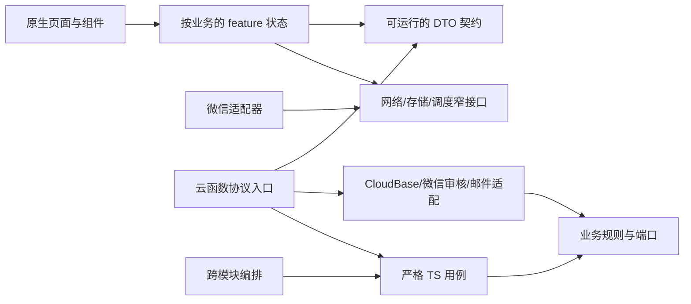

# LynkU 全项目深查与升级设计依据

日期：2026-09-21。性质：源码审计、官方文档对照和设计依据；不是上线通过声明。基线为 LynkU `be9707a` 加已有 typings 5.2.3 更新。本轮没有部署、修改云数据或重新发送认证邮件。执行顺序统一维护在[既有 R0–R8 计划](../plans/refactor/plan.md)，实际修复与检查结果统一维护在[状态表](../plans/refactor/status.md)。

## 结论

保留原生微信、CloudBase、Skyline/Glass-Easel 与 npm workspace。现有目录和独立构建具备继续演进的基础，主要问题是剩余业务边界、接口消费者同步、页面生命周期、状态传播和发布证据不完整。没有证据支持换成 Taro/React、另建 JWT 后端或拆微服务。

盘点范围：14 个主包页面、1 个聊天分包页面、6 个生产函数、18 个集合、contracts/server/adapters、构建/检查/迁移脚本、CI、现有测试与平台报告。当前客户端仅 editor 已形成 feature/ports/composition；其余页面和 services 仍共同管理业务。服务端已有 identity/content/drafts/messaging/comments/notifications，只有部分 CloudBase 仓储已进入 adapters。

本轮修复前 `npm run check` 217 项通过，但真实匿名评论入口仍存在未定义变量。这说明现有检查有价值，也有分支覆盖缺口，不能用通过数量代替完整流程验收。此前 26 项运行时冒烟为历史部分证据，本轮未重新执行云端检查。

## 微信官方文档与项目决策对照

以下微信框架资料均从 `developers.weixin.qq.com` 实际读取，CloudBase 资料来自腾讯官方。官方平台约束与本项目工程设计分别列出；feature/ports、会话代际、outbox、单仓库不是微信强制目录规范。

| 官方依据 | 现有代码与差距 | 本项目采用的设计 |
|---|---|---|
| [Page 生命周期](https://developers.weixin.qq.com/miniprogram/dev/reference/api/Page.html)：隐藏和卸载是不同回调 | post 只在 onShow 取一次身份，卸载只停轮询；drafts 缺少卸载失效 | 页面 scope 管理显示状态、请求代际和订阅；onHide 停调度，onUnload 使迟到结果无效；业务 feature 经窄接口使用这些能力 |
| [合理使用 setData](https://developers.weixin.qq.com/miniprogram/dev/framework/performance/tips/runtime_setData.html)：更新频率、组件树和更新数据量都会影响开销 | 消息/评论全量合并及多处角标刷新尚无设备成本基线 | 只输出变化的渲染字段；请求合并与后台暂停；测量列表规模、更新耗时和调用次数后再决定虚拟列表，不凭文件长度断言卡顿 |
| [使用分包](https://developers.weixin.qq.com/miniprogram/dev/framework/subpackages/basic.html)、[代码包优化](https://developers.weixin.qq.com/miniprogram/dev/framework/performance/tips/start_optimizeA.html) | 已有聊天分包和 requiredComponents；此前总包约 454 KiB，暂无线索表明包体接近上限 | 保留三项 tabBar 页面在主包；聊天内部状态留分包；其他低频页面按性能数据决定是否分包，遵守引用边界并用官方静态依赖分析检查上传内容 |
| [Skyline 起步](https://developers.weixin.qq.com/miniprogram/dev/framework/runtime/skyline/migration/index.html)、[兼容问题](https://developers.weixin.qq.com/miniprogram/dev/framework/runtime/skyline/migration/compatibility.html) | app.json 配置 renderer 不证明每台设备实际命中 Skyline；未完成回退渲染验收 | 报告记录设备、微信版本、基础库和实际 renderer；覆盖 Skyline 与 WebView、键盘/滚动/安全区/长文本；AB 实验和 rendererOptions 单独核实，不盲目复制配置。官方页面的最低版本表也有不同表述，以目标设备实测关闭差异 |
| [注册页面](https://developers.weixin.qq.com/miniprogram/dev/framework/app-service/page.html)支持 Page，复杂页面可采用 Component 注册 | 项目现有 Page 与自定义组件可正常工作 | 不机械重写所有 Page；先抽出业务状态，只在复用行为/生命周期确有收益时采用 Component/behaviors |
| [文本内容安全识别](https://developers.weixin.qq.com/miniprogram/dev/server/API/sec-center/sec-check/api_msgseccheck.html)要求服务端调用，支持云调用与 pass/review/risky 结果 | 目前只有本地敏感词；posts 的 moderate 是同步布尔结果，昵称更新没有同一审核边界 | 定义异步审核端口，微信云调用适配负责平台参数与错误分类；帖子、评论、资料分别接入，故障不当审核通过，保留原文编辑/草稿 |

**审核接入的实际约束：**官方当前单次文本上限 2500 字，OPENID 需近期访问，未上架账号另有较小日配额。项目帖子正文上限为 10000（[契约](../../packages/contracts/src/post-create.ts)第 16 行），不能未经产品决定就缩短上限，也不能只检前 2500 字。需选择并验证保留上下文的分段策略，逐段结果取严格结论、任何失败不公开；记录段摘要/内容版本/trace_id，不能认为分段检测与整篇理解完全等价。未发布账号应限制集成夹具调用次数。请求应在业务事务外完成，提交时绑定被检查内容的摘要和版本，避免事务自动重试重复调用外部服务。图片/音频功能若将来真正启用，再接对应异步接口，不为未有的功能建空模块。

## 已确认缺陷与风险清单

下表路径以 LynkU 根目录为基准，行号是本次审计位置。P1 表示优先阻断功能/数据风险；P2 表示后续切片必须收敛。没有证据证明已经发生的云端结果，不写成既成事故。

| 编号 | 优先级/证据 | 触发、影响及位置 | 验收要求 |
|---|---|---|---|
| F01 | P1，入口复现；本轮已修 | comments/index.js 原第 178 行引用不存在的匿名常量，匿名创建返回 OPERATION_ERROR | 新入口行为测试先失败后通过；匿名展示统一交给公共投影，重试不重复计数/通知 |
| F02 | P2，客户端复现；本轮已修 | comment-item 仍读 author._openid，而 CommentView 已改顶层公开标识；实名作者跳转失效 | 评论与回复导航通过，匿名不因修复重新暴露身份；见 tests/comment-client-regression.test.js |
| F03 | P2，客户端复现；本轮已修 | services/watch.ts 将软删除当物理移除父节点，仍有效回复在构树后消失 | 删除父评论保留无正文/无身份占位，回复仍在，重复变更不重复显示 |
| F04 | P1，源码和合成读取证明；未跑云删除链路 | comments/index.js:315 固化通知预览，删除:273 不撤回；adapters/cloudbase/messaging.ts:129 和 contracts/notifications.ts:53 继续返回旧片段 | 删除/下架后所有通知渠道不返回旧正文；处理删除与消费的任意先后顺序，不能只补一次批量更新 |
| F05 | P1，注入读取故障已复现；最终云提交后果待验证 | comments/index.js:296 把任意 counter.get 失败当不存在、写回 sequence=1；:217 对幂等记录读失败也继续写 | null 才代表缺失；其他错误中止事务。注入超时/权限失败，序列不倒退、不覆盖既有幂等记录；G3 验证真实事务行为 |
| F06 | P1，页面探针复现 | post.ts:48/58 和 drafts.ts:21 缺完整身份订阅/请求失效；冷启动身份恢复后仍显示游客，销毁后迟到请求仍 setData | 身份晚恢复、前后台、卸载、清会话矩阵；不是已证明的云端越权 |
| F07 | P2，页面探针复现 | search.ts:44/69 输入新词却保留旧查询 offset；A 页后输入 B 再加载更多，跳过 B 首屏并混入 A 结果 | inputText 与 submittedQuery 分开，游标绑定查询；切词后不混页 |
| F08 | P2，算法缺陷 | posts/index.js:104/185 公共列表和搜索仅按 created_at 排序并 offset 分页 | 采用 (created_at,_id) 稳定游标，验证同时间、插入、删除、查询切换；不能只加并列排序就声称解决 offset 漂移 |
| F09 | P2，代码与契约差异 | messages.wxml:3、post.wxml:73、utils/guard.ts:10 仍固定提示认证不可用；email-verify.ts:60 将已认证用户跳走，换绑流程无入口 | 统一能力提示；首次认证与换绑分开，新邮箱确认前旧认证保留 |
| F10 | P2，代码路径确认 | post.wxml:3 没有首次请求失败/不存在的完整状态；post.ts:129/180 忽略 flagged 回执 | 明确 loading/ready/unavailable/error；待审回执不显示为公开发布成功，有重试且不丢输入 |
| F11 | P2，源码交错推导，未云复现 | users/index.js:220–237 完成资料投影后，另一个创建请求仍可能用早先取得的 v1 快照写入，永远错过 v2 投影 | 创建事务通过窄端口读取当前资料版本，或经证明的追平机制；覆盖“投影完成后旧请求才提交” |
| F12 | P2，规则缺陷/DTO 债务 | categories/index.js:30 创建禁用名称，但:71 更新不执行同规则；列表:23 隐藏该名称却仍为 active，发帖可选中。列表/更新直接返回数据库对象 | 统一可用性规则、显式分类 DTO；确定性初始化替代运行时尝试建表/吞错。已有唯一名称索引无需重新发明 |
| F13 | P2，审计缺失/策略冲突 | post-status.ts:53、comments/index.js:268 管理员删除无审计；common/index.js:58 admin 只看角色 | 管理动作逐项声明认证要求，保留本人删除无需认证的例外；状态变更与最小管理审计一起提交 |
| F14 | P2，协议/容量设计缺口 | watch.ts:91 从序列 0 重放，post.ts:79 用当前展示数量做 offset，:252 增量又失效列表请求 | 快照水位+稳定历史游标+独立增量缓冲；千条评论/多页变化/半途失败/重新进入不丢不重且内存有界 |

管理员认证、公开 userId、删除通知展示均以[产品契约](../product/behavior-contract.md)为依据，不冒充微信平台通用规则。

## 应保留的基础与目标边界

保留可信微信身份、学校邮箱排他绑定事务、匿名 DTO 显式映射、消息通道隔离/序列/幂等、草稿版本冲突、帖子状态与分类计数事务、outbox 租约隔离、共享锁文件和独立函数构建。这些已有规则和行为测试构成迁移基线。

| 业务 | 当前可信资产 | 目标及旧实现退出条件 |
|---|---|---|
| 身份/邮箱 | ensure、会话代际、可信 OPENID、验证码与排他绑定 | 账号状态唯一来源；客户端能力提示与服务端策略一致；邮件/审核适配不进业务规则；旧 auth/users 包装只有全部调用者迁入后删除 |
| 内容/分类/草稿 | 严格 TS 帖子/草稿用例和 editor feature | 统一公开分页，分类 DTO/可用性，审核与内容版本绑定；SDK 查询从 posts/categories 入口退出 |
| 评论/回复 | 显式 CommentView、增量失败不推进游标 | 创建/删除/快照/序列进入 comments TS；评论通过 content 计数接口在同一事务编排，保留两级和删除占位 |
| 消息/通知 | 通道隔离、发送幂等、真实消息适配接口 | 通知源状态校验/撤回、合并未读调度、消息与通知状态独立；不要按真实对端合并匿名来源 |
| 资料投影/outbox | 认领租约、attempt fencing、已读不被重放重置 | 各模块拥有自己表的写入，workflows 编排；消除 users 直接写 posts/comments/notifications；验证晚创建、乱序和工作者失联 |
| 页面状态 | editor 已有 controller/ports/composition | 先详情、搜索/列表、消息、草稿；渲染状态与请求状态分离，账号代际+页面代际共同失效；网络适配器返回已验证 DTO |

不创建通用万能 store、共享业务 utils 或没有调用者的 framework 包。名称选择按当前真实模块收敛，不为把 comments 改名 interaction、把 @lynku 改为 @lynku 先做全仓库搬迁。

## 工具链和运行时升级矩阵

| 项目 | 当前 | 设计决定与验证条件 |
|---|---|---|
| 本地/CI Node | 24.21.0 | 保持锁定；本地与云版本分别记录 |
| CloudBase runtime | Nodejs16.13 | 优先隔离验证 Nodejs24.11，22.21 为受支持备选；测试 SDK 安装、可信身份、事务、邮件 TLS、timer 和冷启动后才切换，不直接改生产 manifest 冒充迁移 |
| TypeScript | 5.9.3 | 先验证 6.0.3，修 moduleResolution/baseUrl/rootDir/types；架构检查和测试依赖编译器 API，7.x 不可直接替换 latest；后续评估官方兼容包 |
| 微信定义/自动化 | typings 5.2.3 / automator 0.12.1 | 当前已是本次查询版本，保留；补业务/设备场景比换工具更有价值 |
| wx-server-sdk | 4.0.2 | 本次查询仍为当前版，先保留；生产锁审计、漏洞路径处置与真实 SDK 集成是升级门槛 |
| esbuild/dependency-cruiser/tsx | 0.28.2 / 18.4.0 / 4.23.15 | 保持已验证锁；不为“全面升级”无差别换依赖 |

运行时依据：[CloudBase 运行环境支持](https://docs.cloudbase.net/cloud-function/runtime-support)明确推荐 24.11，而[CLI 配置页](https://docs.cloudbase.net/cli-v1/functions/configs)仍写 22/24 公测并推荐 20，存在文档不同步。以运行时专页设计、以目标租户实测验收；[Node 官方状态](https://nodejs.org/en/about/previous-releases)已列 20 为 EOL，不能把“平台仍可选”当安全维护承诺。此处修正先前“下一步上 Node20”的长期方向。

TypeScript 依据：[TS6 发布说明](https://devblogs.microsoft.com/typescript/announcing-typescript-6-0/)和[TS7 发布说明](https://devblogs.microsoft.com/typescript/announcing-typescript-7-0/)。仓库 tooling/architecture/check.mjs、guest-session/editor 测试直接使用编译器 API，升级必须验证这些消费者；项目 npm 编译器也不等同开发者工具内置编译器。

## 发布与运维缺口

| 风险 | 现有证据 | 目标门槛 |
|---|---|---|
| 生产审计被根依赖分类掩盖 | 根 wx SDK 是 devDependency，根 audit --omit=dev 为 0；config/cloud-runtime 同命令仍为 1 moderate/4 high | CI 同时扫描工具链与真正生产锁，记录可达性和处置。当前 SDK set/unset 仅见 realtime 路径、应用无 watch，尚未证明可利用；不能降级 SDK 或隐藏依赖伪造零告警 |
| 构建测试不等于目标平台执行 | check-cloud-artifacts 用当前 Node；verify-cloud-bundle 用 SDK fixture | 代表产物隔离 npm ci、实际 require SDK、目标 Node 执行，再做 G3 真实数据库/事务 |
| 上传不保证配置同步 | wechat-cli.mjs:45 上传后只提醒核验；initialize-cloud 只列期望权限 | 部署读回 runtime/timeout/timer/ACL/index 与产物摘要，逐项失败则发布失败；不重新引入临时业务函数维护后门 |
| 第二发布通道不可复现 | deploy-functions.sh:57 使用 npx 未固定 miniprogram-ci；create-and-deploy 使用全局 tcb | 保留一个有锁、先验收后部署的入口；其余入口删除或严格调用同一流程 |
| 历史迁移工具不适合新 AppID | apply-identity-migration.js:19–23 只将环境记 journal，执行没显式绑定；:37 有 1000 行边界，:62 删除重复账号 | 旧一次性工具先封存；复用前须明确备份 AppID/env、摘要、全分页、dry-run、保留对象和恢复 journal。没有证据说明已发生错环境操作 |
| 验收报告可能误解 | demo-smoke 有条件跳过且报告不含提交/实际云版本；空公开列表也能通过匿名检查 | passed/failed/skipped 分开，绑定源码/锁/schema/产物与真实平台配置；覆盖已认证双账号完整流程 |
| 备份与回滚仍未成闭环 | build manifest 只记录 bundle hash，dist 可覆盖；运行手册仍为框架 | 不可变 release 归档；在隔离环境实际恢复并核对身份、内容、会话、计数；部分部署失败有逐函数版本矩阵 |
| 观测不足 | common 保留原始 error 日志，又缺少统一 requestId/action；只有 outbox 局部计数 | 结构化允许字段日志、请求关联、错误/延迟/最老事件年龄/重试积压；不输出正文、验证码、邮箱或匿名映射 |

安全依赖公告参考 [Lodash 官方 advisory](https://github.com/lodash/lodash/security/advisories/GHSA-xxjr-mmjv-4gpg)。这是依赖风险说明，不是已经发生攻击的结论。

## 预备上线的可检查定义

1. G1/G2：全部现行入口的类型/静态检查、独立构建和行为回归通过；每个新发现均有保护行为的测试，JS 未定义符号不再只靠语法检查。
2. G3：空库和带历史夹具均验证；学校认证→发帖→两级评论→通知→删除，草稿冲突与恢复，双账号普通/匿名私信与已读，真实重试/事务竞争/timer 失联回收通过。
3. G4：记录实际 renderer，覆盖 Android/iOS、WebView 回退、分享直达、冷启动身份晚返回、键盘/滚动/安全区、隐藏与销毁、弱网和分包首次进入。不把开发者工具预览等同真机验收。
4. 运行准备：审核平台配额和故障策略可验证；生产锁风险有处置结论；配置读回、最小审计、数据清理规则、监控与恢复演练有证据。产品隐私/保留政策需单独确认，不从代码分析推断合规结论。
5. 遗留退出：每个迁入模块只有一个规则来源；兼容层只承担明确仍需的转换并有退出条件；不删真实身份、备份或未完成记录来制造“零遗留”。

实施按总计划的优先级切片执行；本次三项评论修复是起点，不能将整份设计标为已实施。后续报告以状态表中的真实结果为准。
