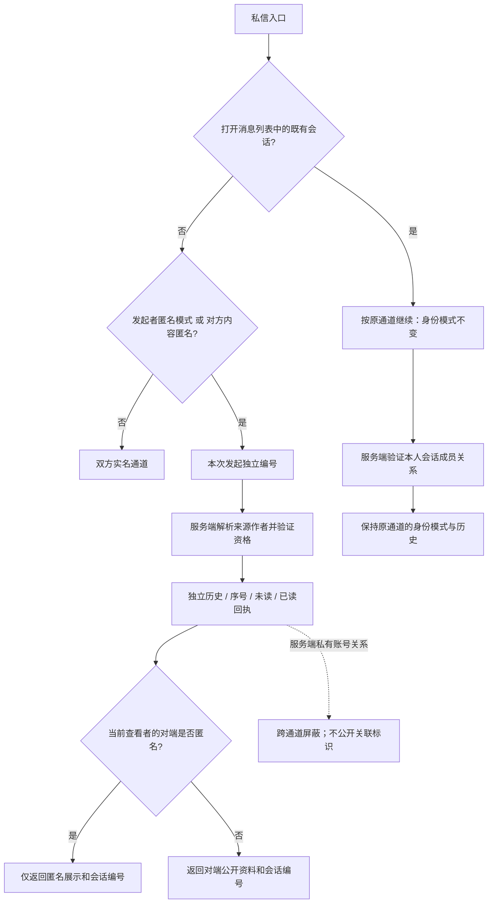

# 产品与权限契约

状态：重构目标规范。当前实现未必满足全部约束；差异必须进入测试和进度记录。

2026-09-21 上线保护补充目标以 [community-safety.md](community-safety.md) 为准：协议隐私、微信自动检查、举报及个案处置／申诉、私信屏蔽和注销。正常发布不等待人工预审，不增加外部审核商或 AI；旧客户端和旧协议直接切换，不保留兼容入口。既有账号、微信关联和认证需要迁移保留。此为本轮设计，不代表已实现。

## 范围

Lucky 是面向 UNNC 的校园社区小程序。保留首页、分类、搜索、帖子详情、两级评论、实名/匿名发言、普通/匿名私信、通知、草稿、资料与设置。现有蓝白视觉和“首页／私信／我的”导航保留，允许修复布局和交互缺陷。

本轮不扩展关注、点赞、群聊、交易、支付、推荐算法、全新管理后台或多端产品。类型中存在 `like`、`follow` 不代表这些功能已经存在或需要补做。保留已有管理能力并提供受控操作方式，不为了展示完整而新增产品。

最新范围允许小程序内处理举报／申诉／隐私请求的最小受控分包，具体边界见 [ADR 003](../architecture/decisions/003-community-safety.md)。不包含运营网站、全站用户监控、任意私信读取或逐条审稿。首次持久建号改为必要隐私告知与明确确认后自动完成，仍只有可信微信基础身份；旧账号认证保留，不能倒填同意记录。

## 身份与权限

2026-09-21 用户修订：微信提供唯一基础身份，启动后自动识别/建立微信账号；未完成学校邮箱认证的微信用户称为“游客”。邮箱认证是在原微信账号上的权限升级，不是第二种登录。管理员是服务端账户角色，不能自动绕过认证要求。身份请求尚未完成或失败时是“身份未就绪”，不另建持久游客身份。

下表“游客”列暂指身份未就绪时的公开浏览降级；“未认证账户”列就是产品展示的微信游客。现有内部状态名 guest/unverified 在客户端迁移完成前仍存在，不能据此恢复旧的独立游客登录产品流程。

| 能力 | 游客 | 未认证账户 | 已认证账户 | 管理员的额外权限 |
|---|---|---|---|---|
| 分类、公开帖子列表、搜索、已发布全文与评论 | 允许 | 允许 | 允许 | 无 |
| 公开内容上的作者摘要 | 允许，匿名必须脱敏 | 同左 | 同左 | 无 |
| 他人完整公开资料页 | 引导主动登录 | 允许，仅公开字段 | 同左 | 无隐私扩权 |
| 自己的资料和设置 | 登录引导 | 允许 | 允许 | 不能从客户端改角色 |
| 发帖、编辑自己的帖子、评论、回复 | 拒绝 | 拒绝 | 允许，另验所有权/内容状态 | 无编辑他人正文权限 |
| 我的帖子、云草稿、私信、通知及角标 | 不请求私人数据 | 拒绝 | 仅本人或会话参与者 | 不能读取他人私信、草稿 |
| 删除帖子/评论 | 不展示账号操作 | 有账户且是作者时允许删除本人内容 | 同左 | 可删除内容并记录审计 |
| 分类维护、帖子标记/解除标记 | 拒绝 | 普通账户拒绝 | 普通账户拒绝 | 允许，另验状态转换 |
| 邮箱验证码发送与校验 | 先取得微信身份 | 允许申请学校邮箱认证 | 允许校验/更换，保留当前认证至新邮箱确认 | 无绕过验证码权限 |

删除本人内容不强制邮箱认证，以保留现有服务端所有权删除语义；界面入口不能扩展到编辑/发布权限。我的帖子页维持认证门槛，未认证作者可从已有内容入口删除本人内容。所有删除都先验证权限，再按目标状态幂等返回，不能因“已删除”提前绕过授权。

邮箱表项为用户已授权的恢复目标；实际入口须待发送、绑定与云端验证完成后启用，不能把本契约更新视为已经上线。原型可以直接替换旧协议和数据结构，不要求旧客户端兼容；指定账号与既有认证保留要求继续生效。

### 客户端会话与服务端身份的区别

- 启动后自动调用 ensure，通过微信可信身份找回原账号或建立未认证账号；登录页不再要求选择独立游客身份。请求失败可继续公开浏览并提供重试，不能把失败伪装成认证成功；恢复身份后不自动重放写操作。
- 云函数从可信运行上下文取得 OPENID；是否有账户、是否认证、是否管理员从服务端读取，不相信请求携带的这些属性。
- 清理本地会话负责停止请求、清空私有视图和隔离缓存；迟到身份请求不能恢复已清理的会话。现有方案没有独立可撤销的服务端登录令牌，清理本地会话不等于退出微信账号或撤销邮箱认证；下次启动自动恢复同一微信身份。不能声称客户端标志能阻止持有同一已认证微信身份的直接调用者访问其本人数据。
- 已有账号、微信关联、邮箱认证、内容所有权和会话保留。用户特别要求保留其微信测试账号及标识 hvydw1 对应的既有账号；标识本身不作为授权依据，不凭昵称或邮箱前缀授予认证，也不推断它们必须合并成同一数据库记录。
- 本轮保留 CloudBase 原生身份，不新增 JWT 或第二套登录后端。`public_only` 等标志只能缩小返回权限，不能提升权限。旧私有读端点也必须查账户认证与资源权限。
- 日后如要求“退出后服务端凭据也失效”，应另立会话协议与迁移决策；不能用客户端布尔值伪装实现。

## 内容与状态

- 公开列表、搜索仅返回已发布内容。他人主页与作者筛选不得把匿名内容和真实作者关联；本人私有列表使用单独权限语义，不能依赖公共筛选的隐式例外。
- 帖子保留 published、flagged、hidden、deleted 的语义。普通读仅公开 published；本人及管理端可按现有需要查看 flagged；删除后的正文不得继续由详情、搜索、通知预览等渠道展示。
- 内容安全接入微信要求的自动检查，明确通过后直接提交；review／risky／故障不能用本地词表放行，也不进入人工待发布队列。词表仅可辅助。正文完整覆盖、版本复验及真实平台验证按上线保护方案执行；接口在业务中可注入不表示要增加多个审核供应商。
- 评论最多两级，父评论必须属于同一帖子且可回复。被删除父评论可作为无正文、无身份的占位保留，以承载仍可见回复。
- 发帖与评论中被标记的内容不计入公开计数、不产生公开互动通知。发布状态转换必须同步调整相关计数，不能只在创建时处理。
- 分类停用不删除历史内容；新发帖/换分类只允许可用分类。原有“二手交易”不恢复，其他新增分类或种子变化不是迁移的隐含工作。
- 编辑器保留创建、编辑、继续草稿、自动保存与离线恢复。保存成功须对应某个内容版本；旧请求不得清除较新编辑的 dirty 状态。

## 匿名与会话隔离

- 匿名不等于游客，也不等于管理员无法在受控后台进行必要管理。产品公开界面与普通用户调用不可获取匿名真实身份。
- 匿名帖子/评论/通知/私信响应不得夹带真实 peer id、作者快照中的 OPENID、邮箱、内部上下文或可跨匿名会话关联的标识。
- 匿名私信由服务端根据来源内容解析目标并校验参与者，客户端不能提交任意真实目标绕过解析。
- 普通会话与匿名会话必须有独立标识。相同两个人之间的普通聊天不得混入匿名聊天历史、未读数或已读操作；不同匿名来源的会话也不得混合。
- 只要任一方匿名，每次从帖子、评论或个人资料新发起私信，都建立独立通道。同一人从同一来源再次发起也不复用；只有从消息列表明确打开已有会话才继续该通道。发送、网络重试、前后台切换不属于新发起。匿名模式下向实名资料发起私信同样进入匿名通道。会话列表、缓存、消息、未读与已读操作均按通道区分，不得按真实对端合并或提示为同一人。
- 匿名私信采用**对端可见性**，不是双方一律隐藏。发起者匿名、对方实名时，实名一方只看到“匿名用户”，匿名一方仍看到实名对方；发起者实名、对方匿名内容时，发起者只看到“匿名用户”，匿名内容作者仍看到实名发起者；双方匿名时双方均只看到“匿名用户”。实名对端可显示昵称、头像和资料入口；匿名对端绝不返回 OPENID、邮箱、真实昵称、头像或可跨通道关联的标识。可见性在首条消息时由服务端写入，不因之后修改匿名开关或内容状态改变。
- 来源内容下架后，不允许从该来源新建匿名会话；已有参与者可以通过受控会话标识继续访问既有会话。此为本轮明确的目标修正，需要迁移测试，不能靠来源公开可见性替代成员权限。

会话隔离阻止系统直接关联身份，不承诺文字内容、发送时间或用户主动透露信息无法被猜测。正常通道不因全局匿名开关改变而静默换身份，聊天页明确标明实名／匿名模式。

## 消息、通知与失败体验

- 消息发送重试不重复创建；已读是单向进展，不能被旧响应改回未读。不得声称客户端未实际实现的“已送达”。
- 已读只覆盖客户端确认展示/读取的范围；后台新到消息不能被页面退出时一次性全部标记已读。
- 会话列表与未读数覆盖完整有效数据，不由最近若干条消息估算；通知读取不在用户请求中全表回填。
- 评论通知与回复通知保留接收规则：不给自己发通知；回复通知给父评论作者，帖子作者不同且非发送者时另收评论通知；同一事件对同一接收目标去重。
- 私人请求失败不能伪装为空列表或零未读；保留可判断的错误/陈旧状态及重试入口。发布成功后的草稿清理失败不能把已成功发布显示成失败，引导重复发布。
- 登出、账号更换、页面销毁后，正在返回的数据不能恢复私有界面。离线草稿必须隔离账户，不能在下一个账户中恢复。

## 实施前必须刻画的当前差异

1. 私信入口仅 send 明确调用 requireVerifiedUser；草稿仅 save 调用。目标要求私有读写统一验证，属于补齐权限，不属于破坏兼容。
2. 普通会话查询目前按双方身份配对，未显式排除匿名上下文；需要构造同一对用户的多个会话验证隔离。
3. 部分删除逻辑在权限校验前处理已删除状态，必须修正顺序。
4. 现有公共/本人 DTO 混用、离线草稿未按账户命名等不能作为目标继续保留。

以上由源码阅读发现，不代表已完成漏洞复现。R0 建立行为证据，R2–R6 实施对应修复；参见[执行计划](../plans/refactor/plan.md)。
